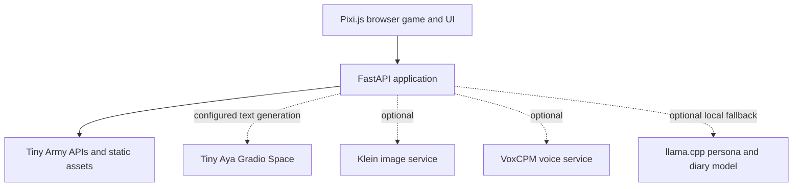

# Tiny Army

Tiny Army is a browser-based RPG sandbox where AI can help create heroes and
conversations, while the game itself runs in the browser. The Python service
provides the application shell, APIs, and static game assets. Image and voice
generation are optional integrations.

## Features

- AI-assisted hero and text generation through a configured Tiny Aya service
- Browser-based gameplay, battles, progression, and character skills
- AI character conversations and war diaries
- Skill forging and dynamic game content
- Sprite, class, enemy, and world-map sandboxes
- Optional generated portraits/artwork and voice audio
- Class sprite fallbacks and browser speech support when optional media services
  are not configured

## Architecture



The main container does not host the Tiny Aya, Klein, or VoxCPM models. It can
start and serve the core game without those services. Configure Tiny Aya to use
AI hero/text generation. Klein and VoxCPM remain optional. A locally configured
llama.cpp persona/diary fallback may download its GGUF on first use; Docker builds
do not download model weights.

## Requirements

- Docker Engine or Docker Desktop
- Docker Compose v2 for the recommended setup

GPU, CUDA, Python, and Node.js are not needed on the host for the core Docker
application.

## Quick Start

```bash
git clone <repository-url>
cd tiny-army
cp .env.example .env
```

Edit `.env` and set `TINY_AYA_SPACE` to the identifier or URL of the Tiny Aya
Space you intend to use. No Space ID is assumed by this repository. Then start
the application:

```bash
docker compose up --build
```

Open [http://localhost:7860](http://localhost:7860). The Compose setup stores
media blobs in the `tiny-army-data` named volume. Stop it with `Ctrl+C`, or use
`docker compose down` (this leaves the named volume intact).

To use a different host port, set `TINY_ARMY_HOST_PORT` in `.env`, for example
`TINY_ARMY_HOST_PORT=8080`, then open `http://localhost:8080`.

## Deploy to Render

Tiny Army can run as a Render **Web Service** using the repository Dockerfile.
The web app listens on `0.0.0.0` and uses Render's injected `PORT` value (with
`7860` as its local default). Do not set a fixed `PORT` in Render's environment.

1. In Render, create a **New Web Service** and connect the repository.
2. Choose **Docker** as the runtime and leave the Dockerfile path as `./Dockerfile`.
3. Add the environment variables the features you want need. Set
   `TINY_AYA_SPACE` to the Tiny Aya Space identifier or URL to enable AI hero and
   text generation. Add `HF_TOKEN` only if that Space requires authentication.
   Klein, VoxCPM, and other optional service variables can remain unset.
4. Set the service health check path to `/health`.
5. Deploy. Render assigns a public service URL; open that URL after the deploy
   reports healthy.

The `/health` response is `{"status":"ok"}` and checks only that the web
application is responding. It does not require Tiny Aya or optional model
services to be available. Render supplies the listening port automatically;
the Dockerfile's `EXPOSE 7860` is only the local default/documentation port.

The main app container does not require a GPU, CUDA, or a local Python/Node
installation. Tiny Aya and optional Klein/VoxCPM services run separately; no
model weights are included in the Docker image.

## Docker Without Compose

```bash
docker build -t tiny-army .
docker run --rm -p 7860:7860 --env-file .env \
  -v tiny-army-data:/data tiny-army
```

Open [http://localhost:7860](http://localhost:7860). The volume preserves
portraits, voices, and other server-side media between container runs. Omitting
the volume is also supported, but data written inside that container is removed
when it exits.

## Configuration

The main app can start without any API key or model Space configured. Without
`TINY_AYA_SPACE`, the game shell is available but Tiny Aya powered text and hero
generation cannot connect. Do not copy a Space ID from another user unless you
intend to use that service.

| Variable | Required? | Purpose |
| --- | --- | --- |
| `TINY_AYA_SPACE` | For Tiny Aya features | Gradio Space identifier (`owner/space`) or URL used for text and hero generation. |
| `HF_TOKEN` | Optional | Hugging Face token for a private Space or model requiring authentication. Keep it in the untracked local `.env` or another runtime secret store. |
| `TINY_KLEIN_SPACE` | Optional | Gradio Space identifier/URL for remote Klein portrait generation. |
| `TINY_VOXCPM_SPACE` | Optional | Gradio Space identifier/URL for VoxCPM speech generation and cloning. |
| `TINY_ACESTEP_SPACE` | Optional | Gradio Space identifier/URL for music generation. |
| `TINY_MINICPM5_SPACE` | Optional | MiniCPM5 text provider Space. |
| `TINY_MELLUM_SPACE` | Optional | Mellum coding provider Space. |
| `TINY_BLS_CODE_SPACE` | Optional | BLS Mini-Code provider Space. |
| `NVIDIA_NIM_API_KEY` | Optional | NVIDIA NIM provider key for supported text/image features. |
| `DASHSCOPE_API_KEY` | Optional | DashScope key for voice design/cloning APIs. |
| `DASHSCOPE_BASE` | Optional | DashScope API base URL; defaults to `https://dashscope-intl.aliyuncs.com`. |
| `DASHSCOPE_VC_MODEL` | Optional | DashScope voice-cloning model; defaults to `qwen3-tts-vc-2026-01-22`. |
| `TINY_LLM_BASE_URL` | Optional | OpenAI-compatible llama.cpp server URL for the persona/diary fallback. |
| `TINY_LLM_API_KEY` | Optional | Bearer key for `TINY_LLM_BASE_URL`, if that server requires one. |
| `TINY_LLM_MODEL` | Optional | Model label sent to an external llama.cpp server and shown in status. |
| `TINY_LLM_MODEL_PATH` | Optional | Path to a local GGUF file mounted into the container. |
| `TINY_LLM_HF_REPO` | Optional | Hugging Face GGUF repository when no external URL or local path is set; defaults to `Qwen/Qwen2.5-0.5B-Instruct-GGUF`. |
| `TINY_LLM_HF_FILE` | Optional | GGUF filename pattern; defaults to `*q4_k_m.gguf`. |
| `TINY_LLM_N_CTX` | Optional | llama.cpp context size; defaults to `2048`. |
| `TINY_LLM_N_THREADS` | Optional | llama.cpp CPU threads; defaults to `2`. |
| `TINY_DATA_DIR` | Optional | Server media directory. Compose sets this to `/data` and mounts a persistent volume. |
| `PORT` | Normally leave alone | Container listening port; defaults to `7860`. |
| `TINY_ARMY_HOST_PORT` | Optional | Compose host port; defaults to `7860`. |

Additional advanced provider settings are read by the application when those
providers are explicitly enabled: `TINY_TTS_MODE`, `QWEN_TTS_MODEL`,
`QWEN_TTS_CLONE_MODEL`, `TINY_IMAGE_MODE`, `TINY_IMAGE_MODEL`,
`TINY_IMAGE_QUANT`, `TINY_IMAGE_VRAM_FRAC`, `TINY_KLEIN_MODEL`,
`TINY_KLEIN_STEPS`, `TINY_KLEIN_GUIDANCE`, `TINY_NEMOTRON_NIM_MODEL`,
`TINY_GRADIO_SERVER`, `TINY_LLM_N_CTX`, and `TINY_LLM_N_THREADS`. These are not
needed for the portable core image. Local TTS/image modes need additional
model-specific packages and hardware that are intentionally excluded from this
Docker image.

## AI Services

### Core text service

Tiny Aya is accessed as a separate Gradio service through `TINY_AYA_SPACE`.
Set this to a Space you control or are authorized to use. The local app passes
`HF_TOKEN` when set; public Spaces may not need it. The container does not
download Tiny Aya weights.

### Optional services

- **Klein** handles optional portrait/image generation via `TINY_KLEIN_SPACE`.
- **VoxCPM** handles optional speech generation/cloning via `TINY_VOXCPM_SPACE`.
- **ACE-Step** provides optional music generation via `TINY_ACESTEP_SPACE`.
- Optional coding, text, and API-backed providers can be configured separately.

The default Docker Compose stack starts only Tiny Army. Missing or unavailable
optional model services do not prevent the app container from starting or core
gameplay from running. The frontend uses class sprites when a hero has no
portrait, and browser speech where available.

## Local Development

The repository supports running the app directly with Python:

```bash
python3 -m venv .venv
. .venv/bin/activate
pip install -r requirements.txt
python app.py
```

Set the same service variables in `.env` or the shell. The app listens on
`0.0.0.0:7860`; the `python-dotenv` dependency loads a repository `.env` file.
`run_sidecars.sh` can start local model sidecars, but those sidecars have separate
large dependencies and are not part of the core Docker setup.

## Project Structure

```text
tiny-army/
├── app.py                 # FastAPI + Gradio app and API routes
├── llm.py                 # Optional llama.cpp persona/diary backend
├── prompts.py             # Text prompts
├── persona_parse.py       # Persona response parsing
├── web/                   # Pixi.js UI, game code, sprites, and static assets
├── spaces/                # Separate optional model service implementations
├── run_sidecars.sh        # Local sidecar launcher
├── requirements.txt       # Main Python dependencies
├── Dockerfile
├── docker-compose.yml
├── .env.example
└── README.md
```

## Troubleshooting

### Port 7860 is already in use

Set `TINY_ARMY_HOST_PORT=8080` in `.env` and restart Compose, then open
`http://localhost:8080`. For `docker run`, change the left side of the port
mapping, such as `-p 8080:7860`.

### The page opens, but AI hero/text generation does not work

Check that `TINY_AYA_SPACE` is set to the correct Space identifier or URL in
`.env`, and that the Space is running and exposes the expected Gradio API. If it
requires authentication, configure `HF_TOKEN` locally; never put the token in
the Dockerfile or a tracked file.

### Klein or VoxCPM reports unavailable

Those integrations are optional. Leave the variables blank for a core gameplay
demo, or set `TINY_KLEIN_SPACE` / `TINY_VOXCPM_SPACE` only after you have a
working service. No external Space IDs are assumed here.

### The container starts, but the page is unavailable

Check `docker compose ps` and `docker compose logs tiny-army`. Wait for the
container health check to pass and confirm the host port is not occupied. The
application listens on port `7860` inside the container.

### Docker build fails while installing llama.cpp

The Docker build uses a CPU wheel when one is available and has a build stage for
architectures where it must compile `llama-cpp-python`. Confirm Docker has enough
memory and disk space. The compiler and CMake tools are not copied into the final
runtime image.

### Persona/diary generation downloads a model or falls back

When `TINY_LLM_BASE_URL` and `TINY_LLM_MODEL_PATH` are unset, the existing
llama.cpp backend downloads its configured GGUF on first use. Configure an
OpenAI-compatible llama.cpp server with `TINY_LLM_BASE_URL`, or mount a local
GGUF and set `TINY_LLM_MODEL_PATH`. This download is separate from the Docker
build and Tiny Aya configuration.

## Security

- `.env` is ignored by Git and excluded from Docker build context. Keep tokens
  and API keys there or in a runtime secret manager.
- Never commit tokens, passwords, credentials, or model weights.
- Pass secrets at runtime; do not add them to `Dockerfile`, source code, or
  image build arguments.
- Use only service IDs and credentials you are authorized to access.

## License

No license file is currently present in this repository. This README does not
assign a license; check with the project owner before redistributing the code.
